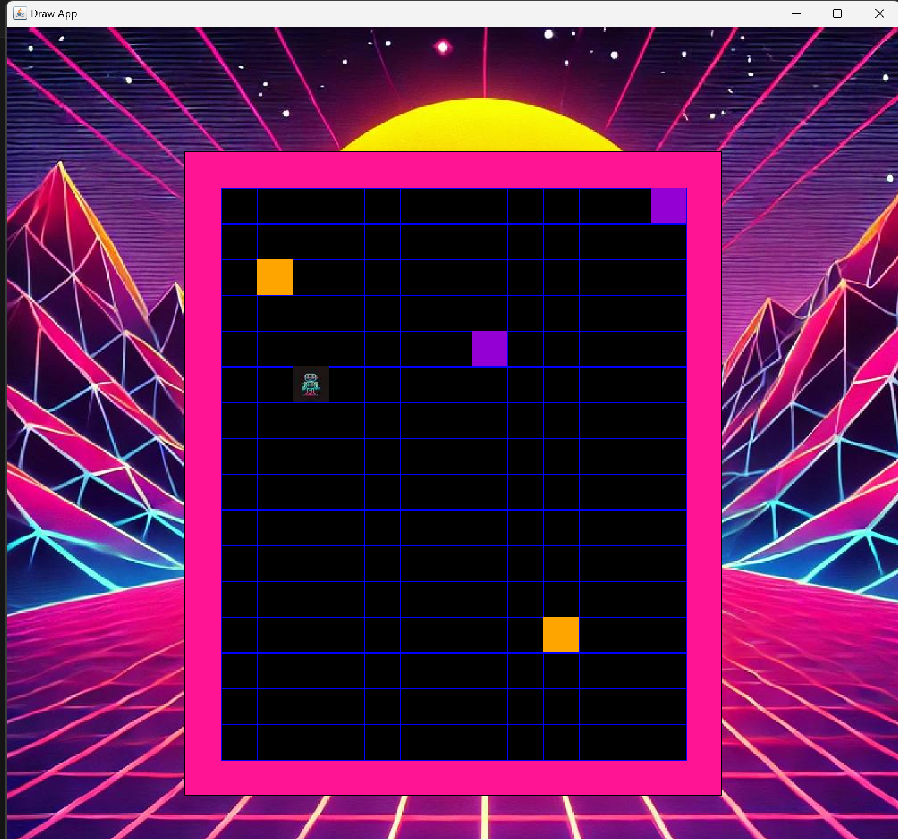

# COMP0002 Coursework Desgined by Zhouzhou Zhang, Nov 2024
A simple robot that can find the marker in an arena

## Compile and Run
To compile: gcc -o robot.exe robot.c graphics.c robot_background.c robot_data.c

To run: ./robot.exe | java -jar drawapp-4.0.jar

# Introduction:

    The robot starts at random position and random orientation in an arena of rectangular shape with random width and height filled with mutiple markers and obstacles.

    The program is now at stage 5 where the robot will seek for markers and take them to corner and end the game.

    *Pink arena, green robot, yellow obstacle and purple markers.

    *Robot try to turn right in default.

# Files Included:

    Robot.c: This is where the main function takes place. This file includes all the other header file and defines the functions that implents the robot. 

    robot_backgrouond: Provides the function used to draw the arena and objects(markers and obstacles).
                        
                       Functions are also defind in the header file.

    robot_data: Provides external variables and functions used to initiliaze the data.

                Data can be modified in this file and also defined in the hearder file.

    jpg files: Used to be displayed in the program

# Features:

    Memory System: Keep narrowing the arena(in a virtual way) until robot finds the marker

                   For instance, initially the minimum x is 0, when robots iterated x = 0, let minimum x to be 1...

    Pass obstacles: Try turn to the obstacle until arriving at the behind of obstacles

    Stuck avoiding: Robot will ignore the obstacle and choose other way if finding himself stuck in an obstacle

    Random generator: Based on the system time

    Array: Uses a 32*32 2D Array where we use as much as we need, as the array is not in the free store.

    UI Desgin: Uses Neon Wave style.

