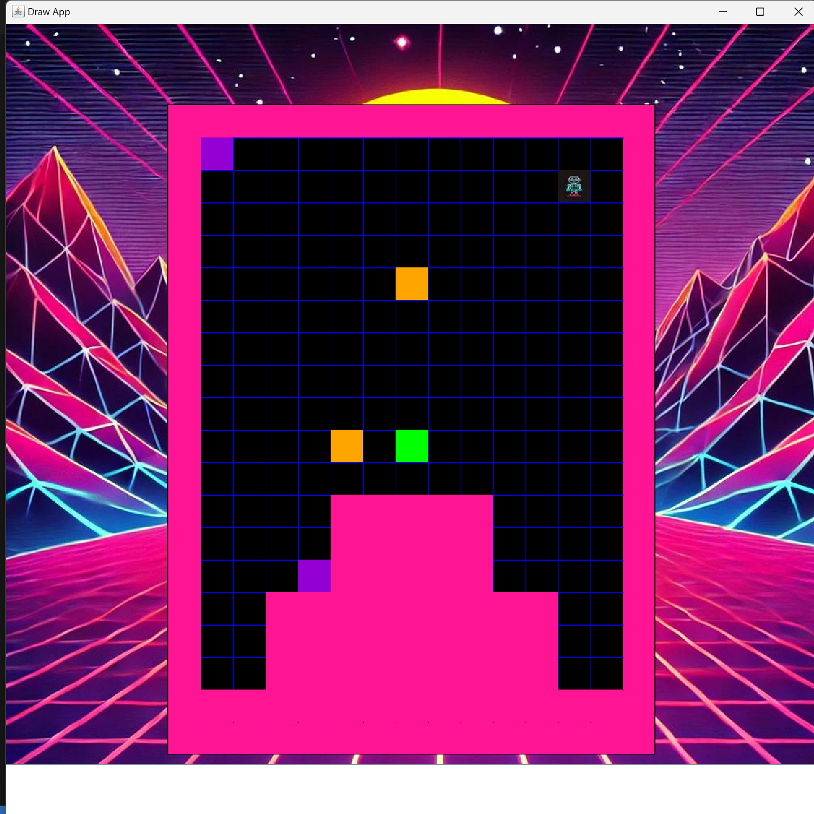

To compile: gcc -o robot.exe robot.c graphics.c robot_background.c robot_data.c
To run: ./robot.exe | java -jar drawapp-4.0.jar

Introduction:
The robot starts at random position and random orientation in an arena of rectangular shape with random width and height filled with mutiple markers and obstacles. The program is now at stage 5 where the robot will seek for markers and take them to corner and end the game.

*Black background, pink arena, green robot, yellow obstacle and purple markers.
*Robot try to turn right in default.

Key algorithm:
How to build memory?: Once the robot has iterated one side of the arena, this side would minus or plus 1, which would keep narrowing the robot and force him to find the marker while the robot is always walking on one side.
How to go through obstacle?: Initially Robot is always trying to turn right, but robot will turn left instead when meeting obstacle. When robot arrives at the behind of the obstacle, he will then stop turning left and continue to turn right.

Files included:
robot.c: The most important file where integrated all functions.
robot_background.c /.h : Store and define the functions to write arena and items
robot_data.c /.h :Store all the necessary data and a function to initiliaze the random data.